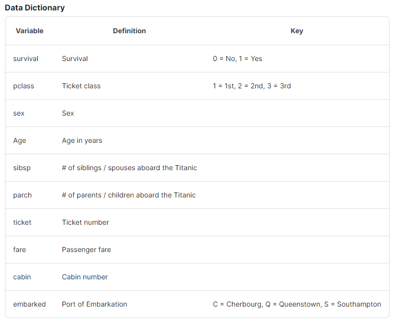
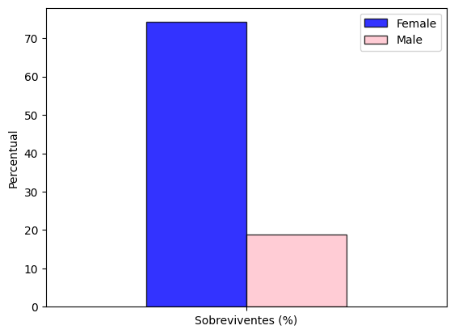
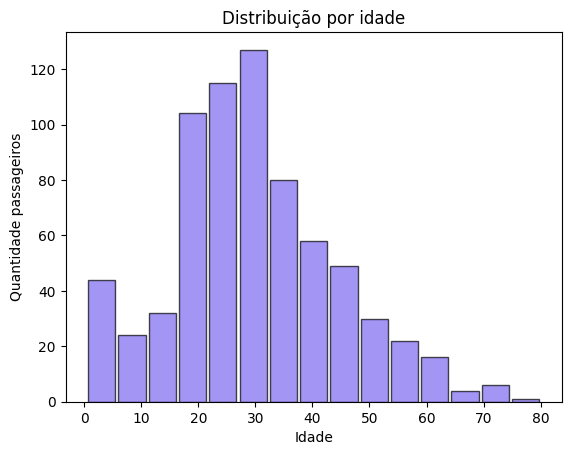
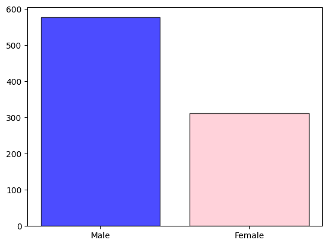
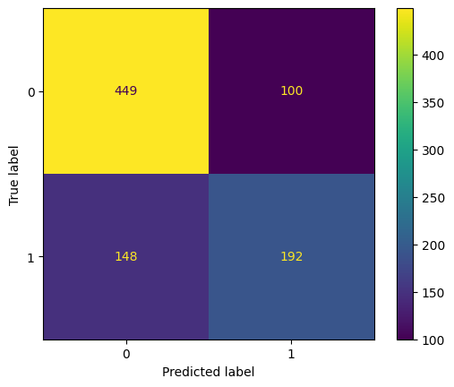

# Titanic - Machine Learning from Disaster




### Variable Notes
**pclass**: A proxy for socio-economic status (SES)
1st = Upper
2nd = Middle
3rd = Lower

**age**: Age is fractional if less than 1. If the age is estimated, is it in the form of xx.5

**sibsp**: The dataset defines family relations in this way...

    Sibling = brother, sister, stepbrother, stepsister

    Spouse = husband, wife (mistresses and fiancés were ignored)

**parch**: The dataset defines family relations in this way...

    Parent = mother, father

    Child = daughter, son, stepdaughter, stepson

    Some children travelled only with a nanny, therefore parch=0 for them.

# Objetivo:
    what sorts of people were more likely to survive?” using passenger data (ie name, age, gender, socio-economic class, etc).


```python
import os
import numpy as np
import pandas as pd
import matplotlib.pyplot as plt
from sklearn.ensemble import RandomForestClassifier
from sklearn.metrics import accuracy_score, confusion_matrix, precision_score, recall_score, ConfusionMatrixDisplay
```


```python
train_data = pd.read_csv('input/train.csv')
test_data = pd.read_csv('input/test.csv')
```

# Análise exploratória


```python
train_data.head()
```


<div>
<table border="1" class="dataframe">
  <thead>
    <tr style="text-align: right;">
      <th></th>
      <th>PassengerId</th>
      <th>Survived</th>
      <th>Pclass</th>
      <th>Name</th>
      <th>Sex</th>
      <th>Age</th>
      <th>SibSp</th>
      <th>Parch</th>
      <th>Ticket</th>
      <th>Fare</th>
      <th>Cabin</th>
      <th>Embarked</th>
    </tr>
  </thead>
  <tbody>
    <tr>
      <th>0</th>
      <td>1</td>
      <td>0</td>
      <td>3</td>
      <td>Braund, Mr. Owen Harris</td>
      <td>male</td>
      <td>22.0</td>
      <td>1</td>
      <td>0</td>
      <td>A/5 21171</td>
      <td>7.2500</td>
      <td>NaN</td>
      <td>S</td>
    </tr>
    <tr>
      <th>1</th>
      <td>2</td>
      <td>1</td>
      <td>1</td>
      <td>Cumings, Mrs. John Bradley (Florence Briggs Th...</td>
      <td>female</td>
      <td>38.0</td>
      <td>1</td>
      <td>0</td>
      <td>PC 17599</td>
      <td>71.2833</td>
      <td>C85</td>
      <td>C</td>
    </tr>
    <tr>
      <th>2</th>
      <td>3</td>
      <td>1</td>
      <td>3</td>
      <td>Heikkinen, Miss. Laina</td>
      <td>female</td>
      <td>26.0</td>
      <td>0</td>
      <td>0</td>
      <td>STON/O2. 3101282</td>
      <td>7.9250</td>
      <td>NaN</td>
      <td>S</td>
    </tr>
    <tr>
      <th>3</th>
      <td>4</td>
      <td>1</td>
      <td>1</td>
      <td>Futrelle, Mrs. Jacques Heath (Lily May Peel)</td>
      <td>female</td>
      <td>35.0</td>
      <td>1</td>
      <td>0</td>
      <td>113803</td>
      <td>53.1000</td>
      <td>C123</td>
      <td>S</td>
    </tr>
    <tr>
      <th>4</th>
      <td>5</td>
      <td>0</td>
      <td>3</td>
      <td>Allen, Mr. William Henry</td>
      <td>male</td>
      <td>35.0</td>
      <td>0</td>
      <td>0</td>
      <td>373450</td>
      <td>8.0500</td>
      <td>NaN</td>
      <td>S</td>
    </tr>
  </tbody>
</table>
</div>


```python
train_data.tail(1)
```


<div>
<table border="1" class="dataframe">
  <thead>
    <tr style="text-align: right;">
      <th></th>
      <th>PassengerId</th>
      <th>Survived</th>
      <th>Pclass</th>
      <th>Name</th>
      <th>Sex</th>
      <th>Age</th>
      <th>SibSp</th>
      <th>Parch</th>
      <th>Ticket</th>
      <th>Fare</th>
      <th>Cabin</th>
      <th>Embarked</th>
    </tr>
  </thead>
  <tbody>
    <tr>
      <th>890</th>
      <td>891</td>
      <td>0</td>
      <td>3</td>
      <td>Dooley, Mr. Patrick</td>
      <td>male</td>
      <td>32.0</td>
      <td>0</td>
      <td>0</td>
      <td>370376</td>
      <td>7.75</td>
      <td>NaN</td>
      <td>Q</td>
    </tr>
  </tbody>
</table>
</div>


```python
train_data.info()
```

    <class 'pandas.core.frame.DataFrame'>
    RangeIndex: 891 entries, 0 to 890
    Data columns (total 12 columns):
     #   Column       Non-Null Count  Dtype  
    ---  ------       --------------  -----  
     0   PassengerId  891 non-null    int64  
     1   Survived     891 non-null    int64  
     2   Pclass       891 non-null    int64  
     3   Name         891 non-null    object 
     4   Sex          891 non-null    object 
     5   Age          714 non-null    float64
     6   SibSp        891 non-null    int64  
     7   Parch        891 non-null    int64  
     8   Ticket       891 non-null    object 
     9   Fare         891 non-null    float64
     10  Cabin        204 non-null    object 
     11  Embarked     889 non-null    object 
    dtypes: float64(2), int64(5), object(5)
    memory usage: 83.7+ KB
    


```python
color = ['blue', 'pink']
plt.bar(train_data['Sex'].unique(), train_data['Sex'].value_counts(), color=color, alpha=0.7, ec='k')
```


    

    


```python
survivor_train = sum(train_data['Survived'])/len(train_data['Survived'])
print("Percentual sobreviventes total: ", survivor_train)
```

    Percentual sobreviventes total:  0.3838383838383838
    


```python
# cria variável women contendo apenas as mulheres do conjunto de dados
women = train_data.loc[train_data.Sex == 'female']['Survived']
women.head()
```


    1    1
    2    1
    3    1
    8    1
    9    1
    Name: Survived, dtype: int64


```python
# Porcentagem de mulheres que sobreviveram
rate_women = sum(women)/len(women)
print('Women who survived: ', rate_women*100, '%')
```

    Women who survived:  74.20382165605095 %
    


```python
# cria variável men contendo apenas os homens do conjunto de dados
men = train_data.loc[train_data.Sex == 'male']['Survived']
men.head()
```


    0    0
    4    0
    5    0
    6    0
    7    0
    Name: Survived, dtype: int64


```python
# Porcentagem de homens que sobreviveram
rate_men = sum(men)/len(men)
print('Men who survived: ', rate_men*100, '%')
```

    Men who survived:  18.890814558058924 %
    


```python
# Percentual dos sobreviventes por sexo
rate = [rate_women*100, rate_men*100]
rate = pd.DataFrame(rate)
rate.rename(columns={0: 'Sobreviventes (%)'}, inplace=True)
rate.rename(index={0: 'Female', 1: 'Male'}, inplace=True)
rate = rate.T
# rate
rate.plot(kind='bar', alpha=0.8, ec='k', rot=0, ylabel='Percentual', color=color)
```


    

    


# Transformação dos dados


```python
# Transforma variável sexo em representação numerica
train_data['Sex'] = train_data['Sex'].replace(['female', 'male'], ['0','1'])
test_data['Sex'] = test_data['Sex'].replace(['female', 'male'], ['0','1'])
```


```python
# Transforma variável embarked em representação numerica
train_data['Embarked'] = train_data['Embarked'].replace(['C', 'Q', 'S'], [0,1,2])
test_data['Embarked'] = test_data['Embarked'].replace(['C', 'Q', 'S'], [0,1,2])
```

      train_data['Embarked'] = train_data['Embarked'].replace(['C', 'Q', 'S'], [0,1,2])
      test_data['Embarked'] = test_data['Embarked'].replace(['C', 'Q', 'S'], [0,1,2])    


```python
# Transforma variável embarked para tipo int. Necessário apagar valores NaN
train_data.dropna(subset=['Embarked'], inplace=True)
train_data['Embarked'] = train_data['Embarked'].astype(int)

test_data.dropna(subset=['Embarked'], inplace=True)
test_data['Embarked'] = test_data['Embarked'].astype(int)
```


```python
# Distribuição dos passageiros por idade
plt.hist(train_data['Age'], bins=15, color='#7B68EE', rwidth=0.9, alpha=0.7, ec='k')
plt.xlabel('Idade')
plt.ylabel('Quantidade passageiros')
plt.title('Distribuição por idade')
plt.show()
```


    

    


```python
# Distribuição dos passageiros por idade
plt.bar(train_data['Sex'].replace('0', 'Female').replace('1', 'Male').unique(),train_data['Sex'].value_counts(), color=color, alpha=0.7, ec='k')
```


    

    


```python
# Verificando correlação entre variáveis 
features = ['Pclass', 'Sex', 'Age', 'SibSp','Parch', 'Fare', 'Embarked']
corr = train_data[features].corr()
corr.style.background_gradient(cmap='coolwarm')
```


<table id="T_9975c">
  <thead>
    <tr>
      <th class="blank level0" >&nbsp;</th>
      <th id="T_9975c_level0_col0" class="col_heading level0 col0" >Pclass</th>
      <th id="T_9975c_level0_col1" class="col_heading level0 col1" >Sex</th>
      <th id="T_9975c_level0_col2" class="col_heading level0 col2" >Age</th>
      <th id="T_9975c_level0_col3" class="col_heading level0 col3" >SibSp</th>
      <th id="T_9975c_level0_col4" class="col_heading level0 col4" >Parch</th>
      <th id="T_9975c_level0_col5" class="col_heading level0 col5" >Fare</th>
      <th id="T_9975c_level0_col6" class="col_heading level0 col6" >Embarked</th>
    </tr>
  </thead>
  <tbody>
    <tr>
      <th id="T_9975c_level0_row0" class="row_heading level0 row0" >Pclass</th>
      <td id="T_9975c_row0_col0" class="data row0 col0" >1.000000</td>
      <td id="T_9975c_row0_col1" class="data row0 col1" >0.127741</td>
      <td id="T_9975c_row0_col2" class="data row0 col2" >-0.365902</td>
      <td id="T_9975c_row0_col3" class="data row0 col3" >0.081656</td>
      <td id="T_9975c_row0_col4" class="data row0 col4" >0.016824</td>
      <td id="T_9975c_row0_col5" class="data row0 col5" >-0.548193</td>
      <td id="T_9975c_row0_col6" class="data row0 col6" >0.164681</td>
    </tr>
    <tr>
      <th id="T_9975c_level0_row1" class="row_heading level0 row1" >Sex</th>
      <td id="T_9975c_row1_col0" class="data row1 col0" >0.127741</td>
      <td id="T_9975c_row1_col1" class="data row1 col1" >1.000000</td>
      <td id="T_9975c_row1_col2" class="data row1 col2" >0.099037</td>
      <td id="T_9975c_row1_col3" class="data row1 col3" >-0.116348</td>
      <td id="T_9975c_row1_col4" class="data row1 col4" >-0.247508</td>
      <td id="T_9975c_row1_col5" class="data row1 col5" >-0.179958</td>
      <td id="T_9975c_row1_col6" class="data row1 col6" >0.110320</td>
    </tr>
    <tr>
      <th id="T_9975c_level0_row2" class="row_heading level0 row2" >Age</th>
      <td id="T_9975c_row2_col0" class="data row2 col0" >-0.365902</td>
      <td id="T_9975c_row2_col1" class="data row2 col1" >0.099037</td>
      <td id="T_9975c_row2_col2" class="data row2 col2" >1.000000</td>
      <td id="T_9975c_row2_col3" class="data row2 col3" >-0.307351</td>
      <td id="T_9975c_row2_col4" class="data row2 col4" >-0.187896</td>
      <td id="T_9975c_row2_col5" class="data row2 col5" >0.093143</td>
      <td id="T_9975c_row2_col6" class="data row2 col6" >-0.032565</td>
    </tr>
    <tr>
      <th id="T_9975c_level0_row3" class="row_heading level0 row3" >SibSp</th>
      <td id="T_9975c_row3_col0" class="data row3 col0" >0.081656</td>
      <td id="T_9975c_row3_col1" class="data row3 col1" >-0.116348</td>
      <td id="T_9975c_row3_col2" class="data row3 col2" >-0.307351</td>
      <td id="T_9975c_row3_col3" class="data row3 col3" >1.000000</td>
      <td id="T_9975c_row3_col4" class="data row3 col4" >0.414542</td>
      <td id="T_9975c_row3_col5" class="data row3 col5" >0.160887</td>
      <td id="T_9975c_row3_col6" class="data row3 col6" >0.068900</td>
    </tr>
    <tr>
      <th id="T_9975c_level0_row4" class="row_heading level0 row4" >Parch</th>
      <td id="T_9975c_row4_col0" class="data row4 col0" >0.016824</td>
      <td id="T_9975c_row4_col1" class="data row4 col1" >-0.247508</td>
      <td id="T_9975c_row4_col2" class="data row4 col2" >-0.187896</td>
      <td id="T_9975c_row4_col3" class="data row4 col3" >0.414542</td>
      <td id="T_9975c_row4_col4" class="data row4 col4" >1.000000</td>
      <td id="T_9975c_row4_col5" class="data row4 col5" >0.217532</td>
      <td id="T_9975c_row4_col6" class="data row4 col6" >0.040449</td>
    </tr>
    <tr>
      <th id="T_9975c_level0_row5" class="row_heading level0 row5" >Fare</th>
      <td id="T_9975c_row5_col0" class="data row5 col0" >-0.548193</td>
      <td id="T_9975c_row5_col1" class="data row5 col1" >-0.179958</td>
      <td id="T_9975c_row5_col2" class="data row5 col2" >0.093143</td>
      <td id="T_9975c_row5_col3" class="data row5 col3" >0.160887</td>
      <td id="T_9975c_row5_col4" class="data row5 col4" >0.217532</td>
      <td id="T_9975c_row5_col5" class="data row5 col5" >1.000000</td>
      <td id="T_9975c_row5_col6" class="data row5 col6" >-0.226311</td>
    </tr>
    <tr>
      <th id="T_9975c_level0_row6" class="row_heading level0 row6" >Embarked</th>
      <td id="T_9975c_row6_col0" class="data row6 col0" >0.164681</td>
      <td id="T_9975c_row6_col1" class="data row6 col1" >0.110320</td>
      <td id="T_9975c_row6_col2" class="data row6 col2" >-0.032565</td>
      <td id="T_9975c_row6_col3" class="data row6 col3" >0.068900</td>
      <td id="T_9975c_row6_col4" class="data row6 col4" >0.040449</td>
      <td id="T_9975c_row6_col5" class="data row6 col5" >-0.226311</td>
      <td id="T_9975c_row6_col6" class="data row6 col6" >1.000000</td>
    </tr>
  </tbody>
</table>


# Machine Learning


```python
# Treinando o modelo
y = train_data['Survived']

features = ["Pclass", "SibSp", "Parch"]
X = pd.get_dummies(train_data[features])
X_test = pd.get_dummies(test_data[features])

model = RandomForestClassifier(n_estimators=100, max_depth=5, random_state=1)
model.fit(X,y)
```


```python
# Previsões e matriz de confusão
predictions_train = model.predict(X)

cm = confusion_matrix(y, predictions_train)
ConfusionMatrixDisplay(confusion_matrix=cm).plot()
```


    

    


```python
# Métricas do modelo
print("Accuracy: ", accuracy_score(y, predictions_train))
print("Precision: ", precision_score(y, predictions_train))
print("Recall: ", recall_score(y, predictions_train))
```

    Accuracy:  0.7210348706411699
    Precision:  0.6575342465753424
    Recall:  0.5647058823529412
    


```python
# Predição com os dados de teste
predictions_test = model.predict(X_test)
predictions_test
```


    array([0, 0, 0, 0, 0, 0, 0, 1, 0, 0, 0, 1, 1, 0, 1, 0, 0, 0, 0, 0, 1, 1,
           1, 1, 1, 0, 1, 0, 1, 0, 0, 0, 0, 0, 1, 0, 0, 0, 0, 0, 1, 1, 0, 0,
           1, 0, 1, 0, 1, 1, 1, 0, 1, 1, 0, 0, 0, 0, 0, 1, 0, 0, 0, 0, 1, 0,
           0, 1, 1, 0, 0, 0, 0, 1, 1, 1, 0, 1, 0, 0, 0, 1, 1, 0, 0, 0, 0, 0,
           0, 1, 0, 0, 1, 0, 1, 0, 1, 0, 0, 0, 1, 0, 0, 0, 0, 0, 0, 0, 0, 0,
           0, 0, 1, 0, 1, 0, 0, 0, 1, 0, 0, 0, 1, 0, 0, 1, 0, 0, 0, 0, 0, 1,
           0, 0, 0, 0, 0, 0, 0, 0, 0, 1, 1, 0, 1, 1, 1, 0, 1, 1, 1, 0, 0, 1,
           0, 0, 1, 0, 1, 1, 0, 0, 0, 0, 0, 0, 1, 0, 1, 0, 0, 0, 0, 0, 0, 1,
           0, 1, 1, 1, 0, 1, 1, 0, 1, 0, 1, 0, 0, 0, 0, 1, 0, 0, 1, 0, 1, 0,
           0, 0, 0, 1, 1, 1, 0, 1, 0, 0, 1, 0, 0, 0, 0, 0, 0, 1, 0, 1, 1, 0,
           0, 0, 0, 0, 1, 1, 0, 0, 0, 0, 0, 1, 0, 0, 1, 0, 1, 0, 1, 1, 1, 1,
           1, 0, 0, 1, 0, 1, 0, 0, 1, 0, 1, 0, 0, 0, 0, 0, 0, 0, 0, 0, 1, 0,
           0, 0, 1, 0, 0, 0, 1, 0, 1, 0, 0, 0, 0, 0, 0, 0, 0, 0, 0, 0, 0, 0,
           0, 1, 0, 0, 1, 0, 0, 1, 0, 0, 1, 0, 1, 0, 0, 0, 1, 0, 0, 1, 1, 1,
           1, 0, 0, 0, 0, 0, 1, 0, 1, 0, 0, 0, 0, 0, 0, 1, 1, 0, 1, 1, 0, 0,
           1, 1, 0, 0, 0, 1, 0, 1, 0, 0, 0, 0, 0, 1, 0, 0, 0, 0, 0, 0, 1, 0,
           0, 1, 0, 1, 1, 0, 0, 0, 0, 1, 0, 0, 1, 0, 0, 0, 1, 0, 0, 1, 1, 0,
           1, 1, 0, 0, 1, 0, 0, 0, 0, 0, 0, 1, 0, 0, 0, 0, 1, 1, 1, 0, 0, 1,
           0, 1, 0, 0, 1, 0, 1, 1, 1, 0, 0, 1, 0, 0, 0, 1, 0, 0, 1, 0, 0, 0],
          dtype=int64)


```python
# Acrescentando a coluna 'Survived' no dataframe de teste
test_data['Survived'] = predictions_test
survivor_test = sum(test_data['Survived'])/len(test_data['Survived'])
print("Percentual sobrevivente total: ", survivor_test)
```

    Percentual sobrevivente total:  0.33253588516746413
    


```python
print('Sobreviventes por dataset: \nTreino:', survivor_train, '\nTeste: ', survivor_test)
```

    Sobreviventes por dataset: 
    Treino: 0.3838383838383838 
    Teste:  0.33253588516746413
    
